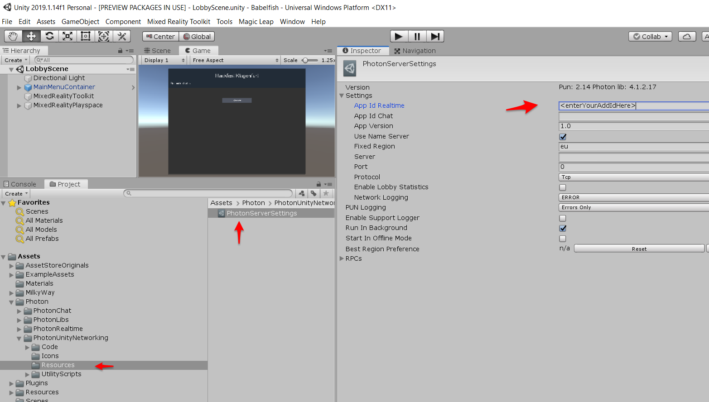

# Mixed Reality Hackathon Example
Boilerplate to start for the Hackfest Klagenfurt

## Getting started
- [Download](https://unity3d.com/get-unity/download/archive) Unity **2019.1.14f1** 
- Download [Visual Studio 2019](https://visualstudio.microsoft.com/downloads/) or [Jetbrains Rider](https://www.jetbrains.com/rider/download/#section=windows)
- Check your windows version Windows 10 Version 1903 (at least 1809)
- Create your account (free) on https://azure.microsoft.com/en-us/
- [Supported languages speech service](https://docs.microsoft.com/en-us/azure/cognitive-services/speech-service/language-support#speech-to-text)
- [Photon Unity Networking](https://www.photonengine.com)
- [Slides](https://www.slideshare.net/StefanWasserbauer/hello-babel-fish-a-mixed-reality-workshop-for-better-communication)

## Setting the Photon App Id
To link this app to your photon cloud service, please create an account at [Photon Unity Networking](https://www.photonengine.com)
Copy the AppId and paste it into the ServerSettings:

## Troubleshooting
NO MATCH error message: Check for your default microphone settings. Let windows assistant fix the setting and try again.
Check if Cortana and/or Speech Recognition is enabled in Windows Settings
